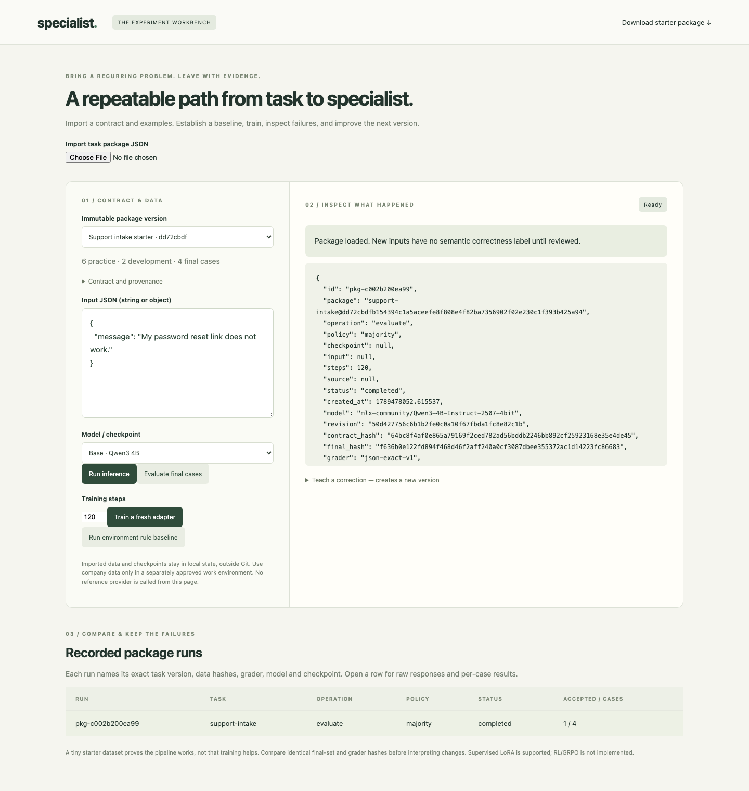

# Specialist Workshop

**Find out whether a small specialist is worth training for your task.**

Bring a narrow task, train real LoRA weights, and compare the results with a base model or an API model. Inspect the answers, add useful corrections, and try again. Task packages keep your examples, output contract and evaluation cases together so you can build on each experiment.

The interesting question is **what does it cost to finish the task well?** A smaller model that needs a few attempts can still be worthwhile. Compare quality, total cost and latency—including retries, verification and fallbacks. [Our first experiment](docs/RETRY-EXPERIMENT.md) puts that idea to the test.

This is an open experiment to try, fork or take ideas from. Start with the included tasks, bring your own examples, or borrow the training and evaluation loop.



## Improve a model with a better solving policy

Compare iterative solo solving, builder–critic feedback, retrieved practice examples,
and selective stronger-model critique on the same task package. The new
[policy comparison runner](docs/capability-policies/README.md) records every role's
calls, candidate identities, final correctness and total cost, including failed attempts.
It supports OpenAI and Anthropic text models; start with a no-cost dry run.

## Start locally

Python 3.12+ is enough to explore packages and deterministic controls. **Apple Silicon is required for local model inference and training.** No API key is needed for the local path. First model use downloads pinned weights from Hugging Face: about 2.5 GB for task packages.

```sh
git clone https://github.com/itsHabib/specialist-workshop.git
cd specialist-workshop
python3 -m venv .venv
.venv/bin/pip install -r requirements.txt
.venv/bin/uvicorn workshop.app:app --host 127.0.0.1 --port 8787
```

Open **http://127.0.0.1:8787/packages**. Download the starter package from the page and import it, or use `examples/support-intake.package.json`.

1. **Inspect the contract.** Inputs, output schema, provenance, and separate practice/development/final cases travel together.
2. **Establish a baseline.** Try the base model before deciding training is worthwhile.
3. **Train and compare.** Load an actual checkpoint and compare on development cases. Run final evaluation explicitly once the approach is frozen.
4. **Inspect mistakes.** See raw responses alongside format validity and semantic scores.
5. **Correct the next version.** Add reviewed practice examples without changing past runs or evaluation data.

For a first run without downloading a model, open another terminal in this directory:

```sh
TASK_REF=$(.venv/bin/python -m workshop.experiment import examples/support-intake.package.json | .venv/bin/python -c 'import json,sys; print(json.load(sys.stdin)["reference"])')
.venv/bin/python -m workshop.experiment run "$TASK_REF" evaluate --policy majority
```

Reload the packages page and open the recorded run. The `majority` control always emits the most common training output, giving you a simple baseline before running a model.

## Three examples to build on

| Package | What it exercises |
| --- | --- |
| [Support intake](examples/support-intake.package.json) | A tiny JSON-output task and immutable corrections |
| [Analytics planning](examples/roxiq-planning.package.json) | Interpret a request, then calculate with deterministic code |
| [CI evidence](examples/ci-practice.package.json) | A resettable environment with observable final outcomes |

[Bring your own task](docs/MONDAY.md) explains data design, baselines, training, comparison, and the limits of the current backend. The [original classifier and API](docs/CLASSIFIER.md) are also available.

## Experiments so far

### Can a cheaper model catch up with a retry?

On 12 analytics tasks, **Luna reached the same 12/12 score as Astra after one validator-guided repair, at 38.5× lower estimated API cost**. Median task latency was 1.75 seconds for Luna and 2.15 seconds for Astra.

| Model | Correct on first attempt | Correct with up to 3 attempts | Total estimated API cost |
| --- | ---: | ---: | ---: |
| GPT-6 Astra | 12/12 | One-shot control | $0.13805 |
| GPT-5.6 Luna | 11/12 | 12/12 | $0.00358 |
| Local Qwen3-4B base | 3/12 | 5/12 | Local cost unpriced |
| Trained Qwen3-4B adapter | 7/12 | 7/12 | Local cost unpriced |

Retries received schema/context validation errors, never the expected answer. The local adapter outscored the base on this sample; retries helped the base recover two tasks but left the adapter's score unchanged. This was a small replay of previously exposed cases, with different API/local token caps, so it is an encouraging example of the cost tradeoff rather than a general benchmark. [Full experiment, costs and raw outputs](docs/RETRY-EXPERIMENT.md).

### What else can you explore?

- **Real local fine-tuning:** the support and analytics experiments train and load actual adapters. The tiny support run exercises the full loop; the analytics study explores output formatting and task accuracy. [Training and evaluation notes](docs/READINESS.md) · [Analytics study](docs/ANALYTICS-EXPERIMENT.md).
- **Tasks with observable outcomes:** the CI evidence example lets a policy inspect fixture evidence and write an advisory in a resettable environment. [Workflow experiments](docs/WORKFLOW-EXPERIMENTS.md).
- **Your own comparison:** import a package, establish a baseline, train, inspect responses and save corrections as a new version. Evaluation defaults to development cases, with an explicit final step. A portable script compares bounded retries using your package and checkpoint. [Walkthrough](docs/MONDAY.md) · [Cost comparison protocol](docs/ECONOMICS.md).

These are early experiments, and the trained adapters still need work before practical deployment. The reports retain the original scores and failures so you can see what changed and choose where to take the next experiment.

## Development and scope

```sh
.venv/bin/python -m pytest -q
node --check static/app.js
node --check static/packages.js
node --check static/practice.js
node --check static/analytics.js
```

This is a single-user localhost application. Keep `.state/`, credentials, model weights, and your imported data out of Git. Run one app worker. Hosted access, arbitrary uploaded tools, automatic promotion, and RL training are outside the current scope.

[Design](docs/DESIGN.md) · [Publication notes](docs/PUBLICATION.md) · [MIT license](LICENSE)
