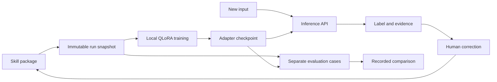

# A narrow skill, a reusable learning loop

This is a standalone product experiment, separate from Workbench's Go infrastructure. The Workbench charter excludes product POCs with independent futures; this workshop consumes a copied evaluation artifact through a data seam. It imports no Workbench decision code and has no authority over the delivery pipeline.

## The concrete contract

Input: a text excerpt. Output: a JSON label and supporting quote. A skill owns the instructions, label descriptions, demonstration examples, validation examples, and external evaluation cases. The first skill is CI failure classification; the second supplied template is support routing. `evidence_mode: line` numbers input lines and asks the model to select a line index. The service resolves that index to the original text. `evidence_mode: quote` asks the model to reproduce the quote directly. This is a representation choice recorded in the skill and prompt fingerprints.

## Small components

- `domain.py`: skill validation, prompt construction, output checks, metrics. It knows nothing about providers or persistence.
- `store.py`: atomic JSON artifacts, model pin, identifiers, state root, runtime lock observation.
- `runtime.py`: pinned local inference and an optional compatible reference provider.
- `worker.py`: finite training/evaluation/inference processes. Only a worker with the accelerator lock can run. QLoRA delegates numerical training to MLX-LM.
- `app.py`: HTTP contract, write-origin checks, snapshot creation, subprocess supervision, checkpoint verification.
- `static/`: an ordinary browser client of the same API a developer uses. Every score is fetched from recorded evaluations.

The platform owns the experiment lifecycle. The skill owns the task. MLX owns gradient computation and execution on Apple Silicon. A new trainer or inference backend can be added without copying a skill's labels into application code.

## What the DeepSeek book contributes

Source: the operator's local *Build a DeepSeek Model (From Scratch)*, v4 MEAP EPUB, chapters 6–8, by Raj Abhijit Dandekar, Rajat Dandekar, Sreedath Panat, and Naman Dwivedi. Read from the existing Ivy library; no book content or code is redistributed here.

- Chapter 6 assembles the foundation-model architecture and pretraining pipeline. That is valuable for understanding the machinery; this POC starts from an existing pretrained model so the experiment isolates specialization.
- Chapter 7 explains policy gradients, GRPO, verifier rewards, cold-start supervision, and the staged R1 pipeline. The design takeaway is to define and validate the reward source before optimizing against it.
- Sections 7.7.2 and 7.7.6 discuss cold-start data and transfer to smaller models. Chapter 8 develops knowledge distillation. Their connection here is a clean place for checked teacher demonstrations in the skill's practice dataset.

The implemented method is supervised QLoRA, not RL or a DeepSeek architecture reimplementation. It trains on authored label/quote demonstrations with loss masked to assistant outputs. There is no claimed teacher distillation in this first dataset. The design can later accept verified teacher-generated examples through the same package API.

For this task, a quote being present is an exact mechanical property. Whether that quote proves a causal CI diagnosis is not. Historical bucket labels also carry ambiguity. Therefore an automatic GRPO reward made only from those checks would overstate what we know. Before an RL phase, independently adjudicate representative incidents and adversarially test the grader. A future executable task could offer a stronger verifier.

## Reproducibility and failure behavior

The model repository and revision are pinned. Runs preserve data, labels, model identity, recipe, adapter digest, and raw model responses. Test rows never become training rows through the correction endpoint. Imported skills reject duplicate IDs and exact normalized input overlap across splits.

Scoring v2 separates label accuracy from schema validity and raw JSON formatting. A single complete JSON markdown fence is unwrapped mechanically, with `raw_json_valid=false`; labels are never repaired or inferred by the scorer. Earlier strict-format runs remain archived with their original raw outputs and metrics.

No test input is truncated at inference: a token budget violation fails explicitly. Training samples exceeding the recipe's 1024-token budget fail before training rather than silently losing their targets. A worker timeout, lost process, failed provider, missing checkpoint, or malformed model response cannot become a success score.

Single-process app coordination avoids overlapping submissions; an OS file lock adds protection across worker processes. Startup detects incomplete abandoned runs. This is a local experiment runner, not a distributed scheduler; a production platform needs leases, cancellation, tenancy, and admission budgets.

## Next experiments that would earn more platform

1. Correct the task's uncertain labels with a domain expert and reserve genuinely new incidents for final qualification.
2. Compare against a well-configured contemporary frontier model and Workbench's existing deterministic or local baseline, using the same input and prompt conventions.
3. Ask a second developer to import a real task with minimal assistance. Measure integration effort, useful corrections, and improvement at fixed quality.
4. Add teacher-generated practice only after checking its labels and evidence. Evaluate the contribution separately from model size and prompting.
5. Consider reward-based training after the grader withstands adversarial tests. Start with the smallest credible experiment.

Useful implementation references: [MLX-LM LoRA guide](https://github.com/ml-explore/mlx-lm/blob/main/mlx_lm/LORA.md), [pinned model](https://huggingface.co/mlx-community/Qwen2.5-1.5B-Instruct-4bit/tree/8b403126fc14f14cfc99bb4cfa72ecbc129ea677), [Shopify Flow](https://shopify.engineering/fine-tuning-agent-shopify-flow).

## Resettable workflow specimen

`practice.py` adds one finite CI environment: read fixture evidence and write an advisory in a disposable directory. The browser replays actions through `/api/practice/step`; model actions use the existing skill/checkpoint inference API. `arithmetic.py` is a narrow deterministic baseline for Blox quantities. These are skill-specific experiments, not an arbitrary tool-execution platform. [Measured results and limits](WORKFLOW-EXPERIMENTS.md) retain failed transfers, real-text diagnostic replays, and the frontier subset.

## Reusable task packages

`packages.py` owns versioned contracts, examples, split boundaries and correction versions. `experiment.py` owns finite supervised jobs and artifact/checkpoint binding. `completion.py` separates a pinned model transport envelope from task JSON. `environments.py` exposes reviewed observe/step/outcome implementations. Generic package APIs and the `/packages` page call these same boundaries; they do not execute uploaded code. [Monday walkthrough and explicit extension limits](MONDAY.md).
